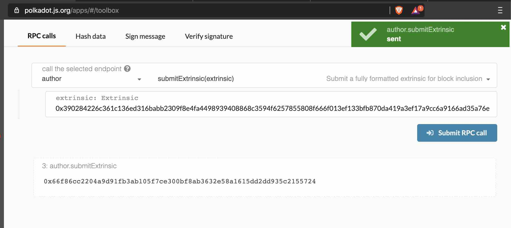

# Generating an offline transaction

There are few different ways to create an offline transaction: by using the [@polkadot@cli-signer](https://github.com/polkadot-js/tools/tree/master/packages/signer-cli), [txwrapper](https://github.com/paritytech/txwrapper), or [Subkey](https://github.com/paritytech/substrate/tree/master/bin/utils/subkey). This guide shows you how to use each one of these for different scenarios. 

## polkadot@cli-signer

This would be the easiest to use if you are looking for a CLI approach and have some basic understanding of public-key cryptography. You can use that to create any transaction and submit it (Extrinsic) to the network directly or you create an offline transaction and then submit it over RPC or [PolkadotJS UI](https://polkadot.js.org/apps/#/toolbox).


### Installation

We assume you have installed [NodeJS with npm](https://nodejs.org). Run the following command:

```
npm install -g @polkadot/api-cli
```
### Creating a transaction

Let's say we want to transfer 0.5 KSM from `DMTHrNcmA8QbqRS4rBq8LXn8ipyczFoNMb1X4cY2WD9tdBX` to `EQ64DQpzBkMcPUqUh7ddvAWmuQFnX3gCPpY8E6F9EsZjHPT`. We need to construct a payload and then use `DMTHrNcmA8QbqRS4rBq8LXn8ipyczFoNMb1X4cY2WD9tdBX` to sign it. 

Executing the following command:

```
yarn run:signer sendOffline --account SENDER_ADDR --ws WEBSOCKET_ENDPOINT RUNTIME_MODULE.FUNCTION RECEIVER_ADDR AMOUNT
```

```
yarn run:signer sendOffline --account DMTHrNcmA8QbqRS4rBq8LXn8ipyczFoNMb1X4cY2WD9tdBX --ws wss://kusama-rpc.polkadot.io/ balances.transfer EQ64DQpzBkMcPUqUh7ddvAWmuQFnX3gCPpY8E6F9EsZjHPT 500000000000

```

You should see 

```
Payload: 0x040050aab27d83bafddea5ffdb5d24fa38b98e3940d08c3744a65214cf7613930c51070088526a743501d0001a040000b0a8d493285c2df73290dfb7e61f870f17b41801197a149ca93654499ea3dafec37cfc20a7851d7139acd706cdc47a3abc6f8b23a28c7f72098138a09e15b4df
Signature> 
```

Then copy the payload and open another terminal to run the following command to sign it. 

```
yarn run:signer sign --account SENDER_ADDR --seed SECRET_PHRASE --type KEYPAIR_CRYPTO_TYPE PAYLOAD
```

```
yarn run:signer sign --account DMTHrNcmA8QbqRS4rBq8LXn8ipyczFoNMb1X4cY2WD9tdBX --seed "normal salon one century nerve timber online engine actress walnut wheel display" --type sr25519 0x040050aab27d83bafddea5ffdb5d24fa38b98e3940d08c3744a65214cf7613930c51070088526a742503cc001a040000b0a8d493285c2df73290dfb7e61f870f17b41801197a149ca93654499ea3dafe6d6b1c0764c0e434e8f690052c72777c916d50aef8185cd5f40d6200c3a557cb

```

Result:

```
Signature: 0x015ec182626a8407cc198d31efb14664e1f6d5b6cbe9190696e91df2c0c6ac1a2be7759be8533b56cd579a5f118dd3e490d7660abf40a3fafc9b10c4ae557ae584
```

Now you can copy & paste the signature to the first terminal. And you will have the signed transaction.

### Submitting to the network

```
Signed transaction:
0x390284226c361c136ed316babb2309f8e4fa4498939408868c3594f6257855808f666f015ec182626a8407cc198d31efb14664e1f6d5b6cbe9190696e91df2c0c6ac1a2be7759be8533b56cd579a5f118dd3e490d7660abf40a3fafc9b10c4ae557ae5843501d000040050aab27d83bafddea5ffdb5d24fa38b98e3940d08c3744a65214cf7613930c51070088526a74
```

With that, you can submit the transaction via [PolkadotJS UI](https://polkadot.js.org/apps/#/toolbox).





One thing to keep in mind is that the transaction will be effective for five minutes. One of the potential use-cases would be a validator is sitting at the Intranet and the validator wants to keep changing the session keys for some periods of time and the only way to access the Internet is through the sentry node. Then the validator can submit the transaction via the RPC. 
